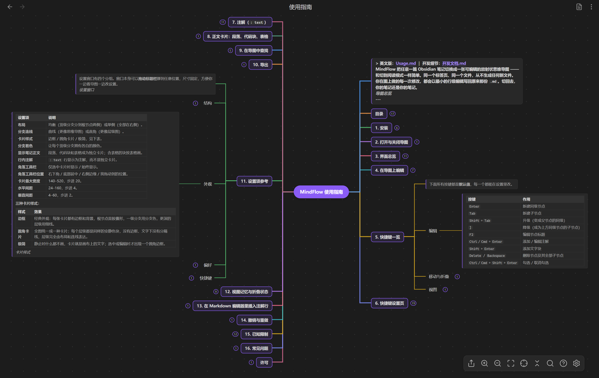
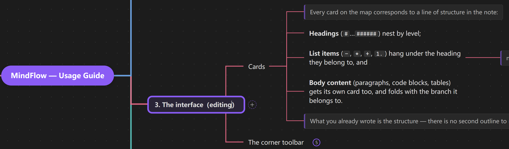
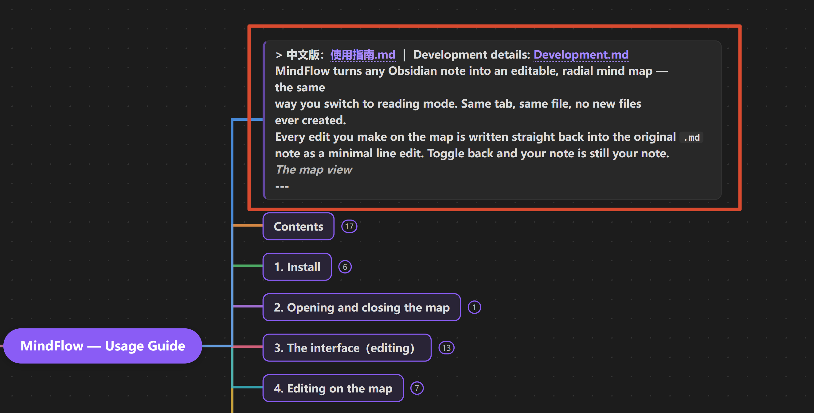
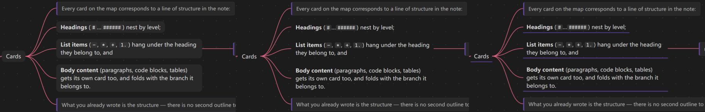
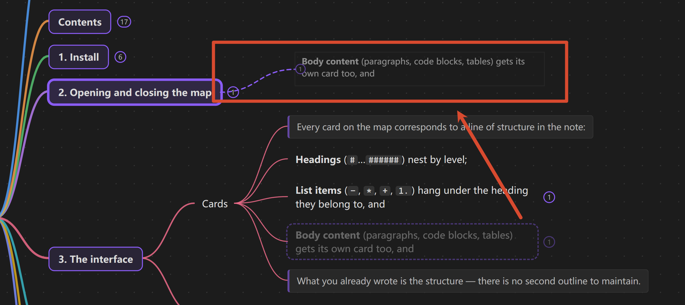
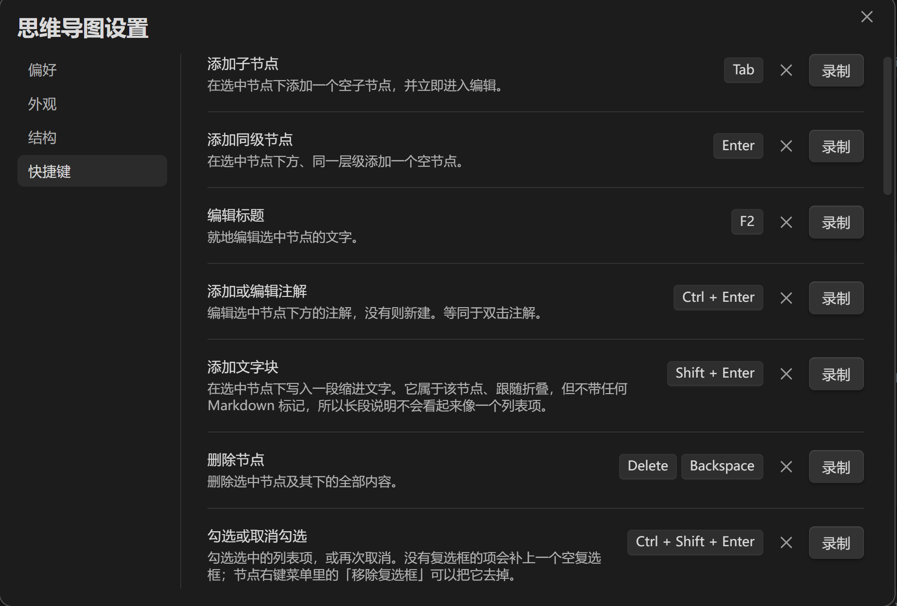
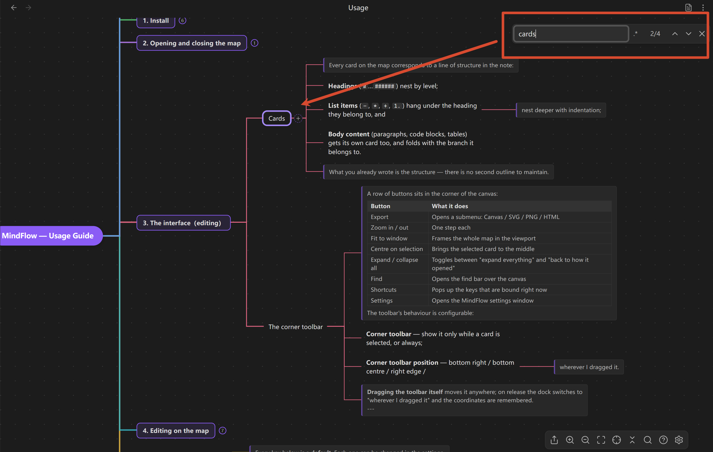

# MindFlow

*[English](README.md) ｜ [使用指南](docs/使用指南.md) ｜ [开发文档](docs/开发文档.md)*

把任意一篇 Obsidian 笔记切换成**可编辑的放射状思维导图** —— 就像切到阅读模式
一样。同一个标签页、同一个文件，**从不生成任何新文件**。

你在图上做的每一次修改，都会以最小的行级编辑写回原来那份 `.md`。切回去，你的
笔记还是你的笔记。



---

## 主要特性

- **是一种视图模式，不是导出。** 切换只是把当前 leaf 的视图类型换掉，同一个
  `TFile` 仍然开在同一个标签页里。不生成、不复制、不写任何附属文件。
- **你的大纲就是导图。** 标题按层级嵌套，缩进的列表挂在它所属的标题下面。你已经
  写好的内容本身就是结构。
- **在画布上就地编辑。** 重命名、新增、删除、缩进、拖拽改父级、拖拽调顺序、
  折叠、勾选复选框 —— 不弹任何对话框，输入框直接开在卡片上。
- **注解。** 在标题或列表项下面写一行 `: text`，它就会以灰色文字贴在卡片下方，
  而不是单独成卡。
- **图片和视频画在卡片上。** `![[hero.png]]` 就是那张图，视频是一张首帧画面加
  两个按钮 —— 一个就地播放，一个交给 Obsidian 自己的播放器。导出的 SVG / PNG /
  HTML 里图片会内嵌进文件，拷到哪都看得到。
- **三种卡片样式。** 边框 / 圆角卡片 / 极简 —— 极简在静止时什么都不画，只在编辑
  时给卡片描一个圆角边框。
- **曲线或直角连线**，工具栏支持四个停靠位置，也可以让它在你选中卡片之前隐藏。
- **回来时还是你离开时的样子。** 折叠形状和焦点按笔记记住，存在插件自己的数据
  里，从不写进你的 markdown。
- **一篇笔记一份撤销历史。** Markdown 编辑器和导图共用一个撤销栈，`Ctrl+Z`
  会一路回退过去。
- **其他一概不动。** frontmatter、围栏代码块、表格、HTML 和链接永远不会被重新
  格式化。你没有编辑过的行逐字节原样返回，包括 CRLF 换行。

## 截图

| 就地编辑                            | 注解                           | 卡片样式                            |
| ------------------------------- | ---------------------------- | ------------------------------- |
|  |  |  |

| 拖拽预览                           | 快捷键设置                                   | 查找                       |
| ------------------------------ | --------------------------------------- | ------------------------ |
|  |  |  |

## 安装

插件尚未上架社区插件市场，需要手动安装。

1. 从 [最新发布](../../releases/latest) 下载 `main.js`、`manifest.json`、
   `styles.css` 三个文件；
2. 放进笔记库的插件目录：

   ```js
   <你的笔记库>/.obsidian/plugins/mindflow/
   ```

3. 打开 **设置 → 第三方插件**，启用 **MindFlow**。

或者下载 `mindflow.zip`，解压到 `.obsidian/plugins/` 下 —— 一步到位。

## 用法

打开一篇笔记，在命令面板里运行 **Toggle mind map view** —— 给它绑一个快捷键，
用起来就像切换阅读模式。

| 按键 | 作用 |
| --- | --- |
| `Enter` / `Tab` | 新建同级 / 新建子节点 |
| `F2` | 编辑节点 |
| `Ctrl`/`Cmd`+`Enter` | 添加 / 编辑注解 |
| `Shift`+`Enter` | 添加文字块 |
| `Delete` | 删除节点及其全部子节点 |
| `Space` | 折叠 / 展开 |
| `Ctrl`/`Cmd`+`Z` | 撤销 |
| `Ctrl`/`Cmd`+`F` | 在导图中查找 |

**按住 `Space` 拖鼠标**可以在任何地方平移画布 —— 压在卡片和卡片上的文字上也一样，
不会变成选中文字。

每一个按键都能改绑，两个动作撞到同一个键时设置页会给出提示。**完整快捷键表、
鼠标手势、设置项说明和导出格式都在[使用指南](docs/使用指南.md)里。**

## 文档

| 文档 | 内容 |
| --- | --- |
| **[使用指南](docs/使用指南.md)**（[English](docs/Usage.md)） | 全部操作手势、完整快捷键表、快捷键设置页教程、注解、正文卡片、查找、导出、全部设置项 |
| **[开发文档](docs/开发文档.md)**（[English](docs/Development.md)） | 架构分层、模块清单、往返改写不变量、如何新增快捷键或设置项、测试与发布流程 |
| [需求与实施方案](docs/需求与实施方案.md) | 项目初期的规划文档（历史记录） |

## 开发

```js
src/model/     解析器 + 变更引擎 —— 纯函数，不 import Obsidian
src/layout/    tidy-tree 布局
src/view/      画布、卡片、连线、交互、公式、TextFileView
src/main.ts    插件：视图注册、模式切换、命令
```

`src/model` 和 `src/layout` 不依赖 DOM 也不依赖 Obsidian，所以可以用 `node --test`
直接做单元测试（Node 22.6+ 原生剥离 TypeScript 类型 —— 无需构建步骤，也无需测试
框架）。

```bash
npm install
npm run dev      # 监听构建，产物直接落到插件目录
npm run build    # 类型检查 + 生产打包
npm run check    # 版本 + changelog + 类型 + 555 条测试 + 构建
```

发版前还要跑一遍审核自己的那套规则：

```bash
npm --prefix tools/obsidian-lint install   # 只装一次；它有自己独立的依赖
npm run lint:obsidian                      # 见 docs/开发文档.md §9
```

**架构、核心不变量，以及如何新增一个快捷键 / 设置项 / 导出格式，见
[docs/开发文档.md](docs/开发文档.md)。**

## 许可

MIT —— 见 [LICENSE](LICENSE)。Copyright (c) 2026 AuroraEchop。

不打包任何第三方代码：没有运行时依赖，公式交给 Obsidian 自带的 MathJax 排版，
图标来自 Obsidian 的 `setIcon`。

XMind、MindNode、Mubu 是各自所有者的商标，本项目与三者无隶属关系，提及它们只是为了描述画布的手感。Obsidian 是 Dynalist Inc. 的商标。
