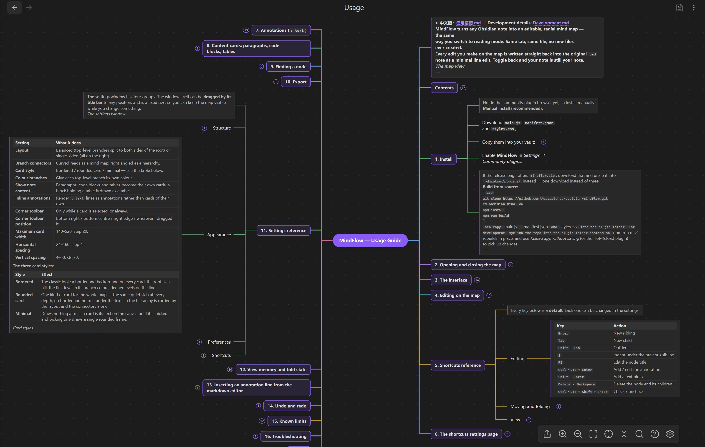
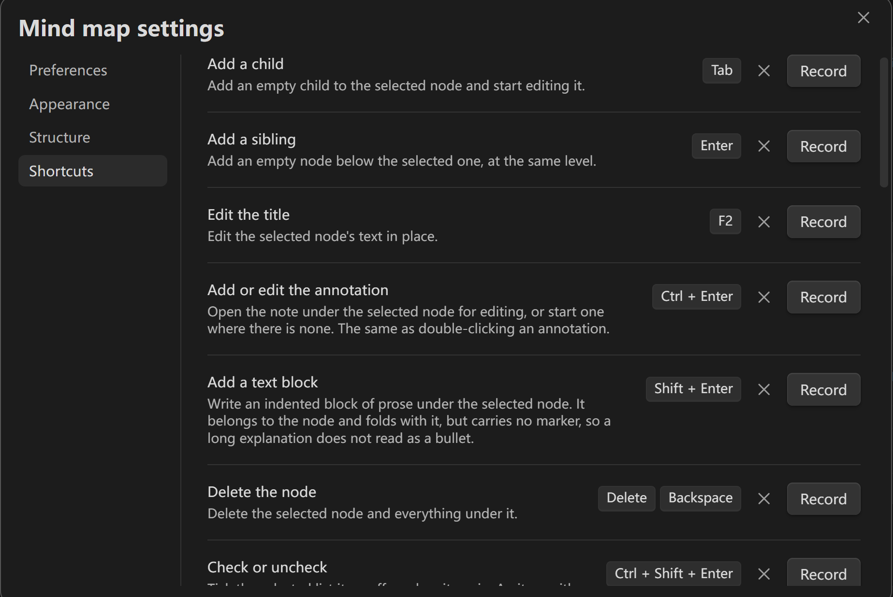
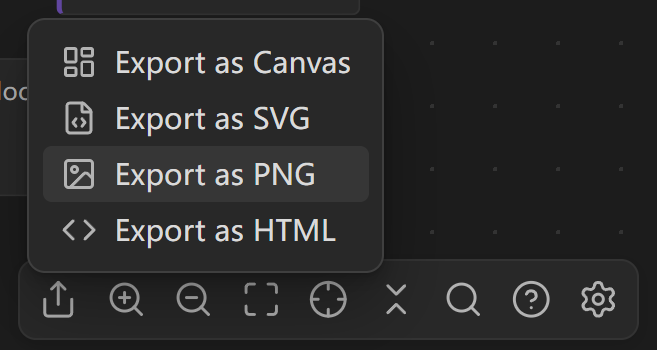
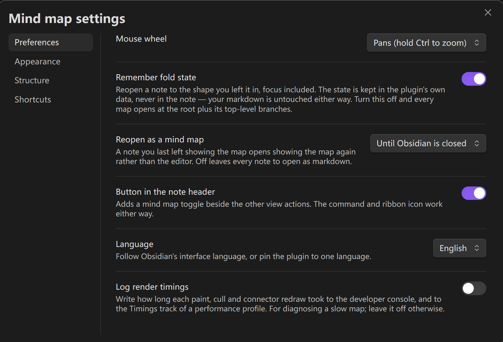
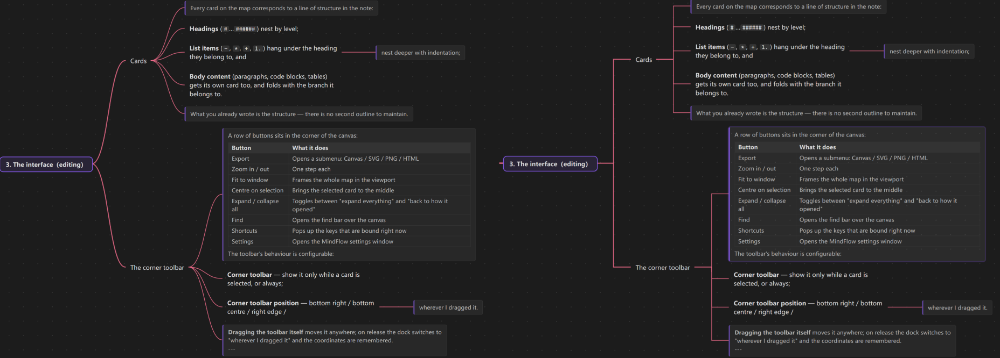

# MindFlow — Usage Guide

> 中文版：[使用指南.md](使用指南.md) ｜ Development details: [Development.md](Development.md)

MindFlow turns any Obsidian note into an **editable, radial mind map** — the same
way you switch to reading mode. Same tab, same file, **no new files ever created**.

Every edit you make on the map is written straight back into the original `.md`
note as a minimal line edit. Toggle back and your note is still your note.



---

## Contents

1. [Install](#1-install)
2. [Opening and closing the map](#2-opening-and-closing-the-map)
3. [The interface](#3-the-interface)
4. [Editing on the map](#4-editing-on-the-map)
5. [Shortcuts reference](#5-shortcuts-reference)
6. [The shortcuts settings page](#6-the-shortcuts-settings-page)
7. [Annotations (`: text`)](#7-annotations-text)
8. [Content cards: paragraphs, code blocks, tables, callouts](#8-content-cards-paragraphs-code-blocks-tables-callouts)
9. [Pictures and videos](#9-pictures-and-videos)
10. [Finding a node](#10-finding-a-node)
11. [Export](#11-export)
12. [Settings reference](#12-settings-reference)
13. [View memory and fold state](#13-view-memory-and-fold-state)
14. [Inserting an annotation line from the markdown editor](#14-inserting-an-annotation-line-from-the-markdown-editor)
15. [Undo and redo](#15-undo-and-redo)
16. [Known limits](#16-known-limits)
17. [Troubleshooting](#17-troubleshooting)

---

## 1. Install

Not in the community plugin browser yet, so install manually.

**Manual install (recommended):**

1. Download `main.js`, `manifest.json` and `styles.css`;
2. Copy them into your vault:

   ```js
   <your vault>/.obsidian/plugins/mindflow/
   ```

3. Enable **MindFlow** in *Settings → Community plugins*.

If the release page offers `mindflow.zip`, download that and unzip it into
`.obsidian/plugins/` instead — one download instead of three.

**Build from source:**

```bash
git clone https://github.com/AuroraEchop/MindFlow.git
cd MindFlow
npm install
npm run build
```

Then copy `main.js`, `manifest.json` and `styles.css` into the plugin folder. For
development, symlink the repo into the plugin folder instead so `npm run dev`
rebuilds in place, and use *Reload app without saving* (or the Hot-Reload plugin)
to pick up changes.

---

## 2. Opening and closing the map

Any of these work, on the note you already have open:

| Where | How |
| --- | --- |
| Command palette | Run **Toggle mind map view** |
| Note header | The branch icon beside the other view actions |
| Ribbon | The branch icon in the left sidebar |
| Context menu | Right-click the note → **Open as mind map** |

There is also an **Open current note as a mind map** command in the palette.

**Close the map** with the same switch: click it again, or run the command again.
Toggling back returns you to whichever markdown mode you came from — source or
reading.

> **Tip:** bind **Toggle mind map view** to a hotkey (say `Ctrl+Shift+M`) to make
> it feel like switching reading mode.

---

## 3. The interface

### Cards

Every card on the map corresponds to a line of structure in the note:

- **Headings** (`#`…`######`) nest by level;
- **List items** (`-`, `*`, `+`, `1.`) hang under the heading they belong to, and
  nest deeper with indentation;
- **Body content** (paragraphs, code blocks, tables) gets its own card too, and
  folds with the branch it belongs to.

What you already wrote is the structure — there is no second outline to maintain.

**A card draws the inline markup you wrote**, so the map reads like the note: bold,
italics, `code`, highlights, strikethrough, `[[wikilinks]]`, links, embedded
pictures and `#tags` — a tag is drawn as a badge, because a tag is a label rather
than somewhere to go. A card holding a table, a fenced sample or a `> [!note]`
callout is drawn as those blocks rather than as the characters they are spelled
with.

### The corner toolbar

A row of buttons sits in the corner of the canvas:

| Button | What it does |
| --- | --- |
| Export | Opens a submenu: Canvas / SVG / PNG / HTML |
| Zoom in / out | One step each |
| Fit to window | Frames the whole map in the viewport |
| Centre on selection | Brings the selected card to the middle |
| Expand / collapse all | Toggles between "expand everything" and "back to how it opened" |
| Find | Opens the find bar over the canvas |
| Shortcuts | Pops up the keys that are bound right now |
| Settings | Opens the MindFlow settings window |

The toolbar's behaviour is configurable:

- **Corner toolbar** — show it only while a card is selected, or always;
- **Corner toolbar position** — bottom right / bottom centre / right edge /
  wherever I dragged it.

**Dragging the toolbar itself** moves it anywhere; on release the dock switches to
"wherever I dragged it" and the coordinates are remembered.

---

## 4. Editing on the map

### Mouse

| Input | Action |
| --- | --- |
| Double-click a card | Edit the node title in place |
| Double-click an annotation | Edit the `: ` lines under that card |
| Double-click a content card | Edit that block in place |
| Click a card | Select it (blue ring) |
| `Shift` or `Ctrl`/`Cmd`+click a card | Add it to the selection; click it again to drop it |
| `Shift`+drag blank space | Sweep a selection box and select every card it covers |
| Click a link in a content card | Open it — note, heading, PDF, attachment or web address |
| `Ctrl`/`Cmd`+click a card | Jump to the line it is written on |
| **+** beside a card | New child |
| Right-click a card | The node's menu |
| Drag a card onto another | Reparent it |
| Drag onto a card's root-facing half | Drop it in beside that card |
| Drag one of several selected cards | Move the whole selection, keeping the order it is written in |
| Drag blank space | Sweep the selection box — or move the map, with [Drag mode](#drag-mode) on |
| Hold `Space` and drag | Pan the canvas — **over a card too**, without selecting its text |
| Wheel / pinch | Zoom |

**Editing happens in place — no dialogs.** The card's text becomes an editable
field with an opaque background, lifted above the other cards so nothing bleeds
through. A **node title and a content block** save on `Enter`; an **annotation**
may hold several lines, so there `Enter` writes one and `Ctrl`/`Cmd`+`Enter`
saves; and inside a **code block** `Shift`+`Enter` starts a new line. All three
cancel on `Esc`, and clicking away or pressing `Tab` saves too.


### Drag mode

A plain drag on blank canvas does one of two things, and **Preferences → Drag
mode** decides which. `Space`+drag and `Shift`+click keep working either way, so
the setting is safe to try:

| Drag mode | A plain drag on blank canvas | The selection box |
| --- | --- | --- |
| **Off** (the default) | Sweeps the selection box | a plain drag |
| **On** | Moves the map | `Shift`+drag |

**On** is how the map worked before the setting existed: the plain press is the
camera's, and the box waits for `Shift`. **Off**, the plain press belongs to the
box and the map is moved with the pan key (`Space`), with the middle button, or by
scrolling — whichever way **Mouse wheel** is set up to allow.

Turning it on the first time puts up a notice saying what moved, since it is a
gesture you already have in your fingers by then. It is the only time it says
anything; turning it off and on again is silent.

### Selecting several cards

`Shift` or `Ctrl`/`Cmd`+click adds a card to the selection, and clicking it again
takes it back out. To catch a handful at once, drag a box over them: a box follows
the pointer and every card it covers is selected when you let go. A box over empty
space clears the selection.

Which press draws that box is [Drag mode](#drag-mode)'s business: with it off a
plain drag draws it, with it on `Shift`+drag does.

Dragging any one of the selected cards **takes the whole selection with it** — the
rings on the others say they are in this too. The run lands together and keeps the
order those cards are written in, and however many of them went, it is one undo
step. A note-content card is the exception: a code block is only carried when it is
the card you picked up, because a block is written under a card rather than being a
card in the tree.

With more than one card selected, the keys that act on a card act on all of them:

| Key | What it does to the selection |
| --- | --- |
| `Delete` / `Backspace` | Deletes every selected card and its subtree |
| `Space` | Folds the selection when anything in it is open, opens it when all of it is folded |

Either way it is **one undo step**, however many cards went. Right-clicking a card
inside the selection and choosing **Delete** does the same thing, and the
selection is only ever held in memory — nothing about it is written into the note.

### Linking a card to another note

A card can point at another note, and the link it writes is an ordinary
`[[Note name]]`, so it works in Obsidian exactly as it does anywhere else. The
card's right-click menu carries it, and so does the command palette:

| Menu item / command | What it does |
| --- | --- |
| Link to a note… | Picks a note from a searchable list and writes `[[it]]` as the card's title |
| New note from this node | Creates an empty note in the same folder, named after the card, and links to it |
| Open the linked note | Goes to it |
| Remove the link | Puts the card's own words back, leaving the text the link was made from |

The last two appear only when the card is a link and nothing else; **Link to a
note…** appears when the card has a name to link from. A link in a card's title
is clickable on the map, so a map can be a way into a vault rather than only a
way of looking at one note.

### Dragging

While you drag, a translucent copy follows the pointer and the original card goes
faint. Over another card, that card highlights to show where the drop would land:

- **The half facing away from the root** — become its child. That is the half the
  card draws its own children on;
- **The half facing the root** — drop in before / after it. That is the column it
  shares with its parent and its siblings, and the height says which way along it.

**The halves mirror with the side the card is on.** The layout keeps a whole
subtree on one side of its parent, so a card left of the root has its children to
its left — and that is where "become its child" is too. Follow the highlight on
the card; there is nothing to work out.

The copy always follows the pointer rather than jumping to a predicted spot — you
judge the landing yourself, and the highlight tells you what the map thinks.


Dragging across the heading/list boundary converts the moved block for you. Drop a
heading onto a bullet and the whole subtree becomes nested bullets; drop a bullet
onto a heading and it becomes a top-level list. Checkbox state survives the round
trip.

**A top-level branch drags like any other card.** Drop it above or below another
top-level branch and it takes that place among the root's own children; drop a
card from any depth beside one and it comes up to that level.

**In balanced layout, a drop past the halfway point changes sides.** The reading
order is down the right-hand column of the root and then down the left-hand one,
and the layout cuts that order in half by subtree weight — so the order is yours
and the side follows from it. To have position and order line up exactly, set
**Layout** to **One side**.

### Panning the canvas

**Hold `Space` and drag with the left button.** That works whatever
[Drag mode](#drag-mode) is set to, and it is the way to move the map with the
pointer when the mode is off. The pointer turns into a hand and
**the canvas moves wherever you started** — over a card, inside a code block,
across a table. It cannot turn into a text selection either, because for as long
as `Space` is down the whole map is canvas: the mouse belongs to it, and a click
does not select a card on the way past. With **Drag mode** on, a plain drag on
blank space moves the map as well.

`Space` counts once it is **released**: press and let go without touching the
mouse and it is the fold it has always been; press the left button at any point
during the hold and that press is a pan, so nothing folds.

---

## 5. Shortcuts reference

Every key below is a **default**. Each one can be changed in the settings.

### Editing

| Key | Action |
| --- | --- |
| `Enter` | New sibling |
| `Tab` | New child |
| `Shift`+`Tab` | Outdent |
| `Ctrl`/`Cmd`+`Shift`+`Tab` | Indent under the previous sibling |
| `F2` | Edit the node title |
| `Ctrl`/`Cmd`+`Enter` | Add / edit the annotation |
| `Shift`+`Enter` | Add a text block |
| `Delete` / `Backspace` | Delete the node and its children — every selected card, when more than one is selected |
| `Ctrl`/`Cmd`+`Shift`+`Enter` | Check / uncheck |

### Moving and folding

| Key | Action |
| --- | --- |
| `Ctrl`/`Cmd`+`↑` / `↓` | Move the node up / down among its siblings |
| `Space` | Fold / unfold — **on release** — the whole selection, when more than one card is selected. Held with the mouse down it pans the canvas instead, and that press does not fold |
| `↑` `↓` `←` `→` | Move the selection |

### View

| Key | Action |
| --- | --- |
| `Ctrl`/`Cmd`+`Z` | Undo |
| `Ctrl`/`Cmd`+`Shift`+`Z` or `Ctrl`/`Cmd`+`Y` | Redo |
| `Ctrl`/`Cmd`+`0` | Fit the map to the window |
| `Ctrl`/`Cmd`+`=` or `Ctrl`/`Cmd`+`+` | Zoom in |
| `Ctrl`/`Cmd`+`-` | Zoom out |
| `Ctrl`/`Cmd`+`.` | Centre on the selection |
| `Ctrl`/`Cmd`+`F` | Find in the map |
| `Ctrl`/`Cmd`+`H` | Find and replace in the map |
| `Esc` | Close the find bar (only the map's while one is open) |

> **`Ctrl`/`Cmd`+`Enter` vs `Shift`+`Enter`:** the first is the annotation (a
> `: text` line hanging under the card), the second is a text block (a separate
> indented block under the card). If you prefer them the other way round, swap
> them in the shortcuts settings.

---

## 6. The shortcuts settings page

*Settings → MindFlow → Shortcuts* (or the toolbar's gear button → Shortcuts) lists
every action the map answers to, one row each, with the keys it is on now.



### Rebinding

1. Click the **Record** button on a row;
2. It turns into **Press any key — Esc cancels**;
3. Press the combination you want.

Whatever you press is what gets bound — `Ctrl`, `Alt` and `Shift` all work. Press
`Esc` to abandon the capture instead; it cancels rather than being recorded.

> **Note:** if a combination does nothing under a Chinese input method (IME) —
> `Ctrl+Enter` is the usual culprit — the IME is swallowing it before the page
> sees it. Something like `Ctrl+Shift+letter` normally avoids the clash.

### Clearing and restoring

- **×** — clears that row's binding, leaving the action on no key at all.
- **Restore the default** (arrow icon) — appears only on a row you have changed,
  and puts the original key back.
- **Restore all defaults** — at the foot of the group, clears every change at once.

### Conflict warnings

Bind two actions to one key and both rows say so:

> Also bound to {the other action} — the one listed first is the one that answers.

Table order is match order, so on a conflict **the higher row wins**. To swap them,
rebind the lower row.

### How changes take effect

- Open maps follow a change **straight away**; no reopening needed.
- The map's own **?** shortcut panel always shows what is bound **now**.
- Only your changes are stored, so a default that moves in a later version moves
  for you too.

---

## 7. Annotations (`: text`)

A line that begins with `: ` under a heading or a list item is an **annotation**: it
hangs under that node's card in muted text behind a vertical rule instead of
becoming a card of its own.

```markdown
### Generalization
: Transfers a skill to an unfamiliar environment.
:
: A second paragraph.

- Adaptation
  : Improves during use.
  : A second line.
```

- Consecutive `: ` lines keep their line breaks;
- A lone `:` is a blank line inside the annotation;
- A long line wraps at the width note content gets — **Maximum card width** × 1.6;
- An annotation may make its card wider than its title alone would, while the title
  itself still wraps at **Maximum card width**;
- An annotation stays visible when its node is folded, and does not depend on
  **Show note content**.


### Editing

**Double-click an annotation**, or pick **Add annotation** / **Edit annotation**
from a node's context menu, and the strip becomes editable in place. An annotation
can hold several lines, so `Enter` writes one and `Ctrl`/`Cmd`+`Enter` saves;
`Esc` cancels, and clicking away saves too. **Saving an empty strip removes the
annotation entirely** — no stray colon left behind.

### About the syntax

This is a convention of this plugin, not of Markdown. Obsidian's editing and
reading views show a `: ` line as an ordinary paragraph that happens to start with
a colon — the note still reads as a note everywhere else, and nothing is added to
the file that only the map understands.

Under a list, indent an annotation to the item's **content column** — the column
the item's own text starts in. Four spaces past that is indented code, and fenced
code is left alone entirely.

Prefer not to see them? Turn **Inline annotations** off in the settings'
*Appearance* group and those lines become ordinary body cards again. Nothing in the
note changes either way.

---

## 8. Content cards: paragraphs, code blocks, tables, callouts

Content that is not a heading or a list item stays exactly where it is in the note
— and gets its own card on the map, folding and unfolding with the branch it
belongs to, interleaved with its siblings in file order. Prose is set in the
reading face and its inline markup is rendered as usual; a code block keeps a
monospace face and its own line breaks.

**A sample is drawn as a sample.** The fence lines are not shown — they are the
note saying "leave this alone", and the card already says it by drawing the block
in monospace. Its top right corner carries the language the fence named, and a
copy button that appears under the pointer (or on keyboard focus) and puts the
whole sample on the clipboard, turning into a ✓ while it does. Both sit above the
code rather than in it, so neither is something the sample appears to contain, and
neither can change the card's size.

**A block holding a table is drawn as a table**: a header row, the alignment each
column's `:` asked for, and the `**bold**`, `` `code` ``, formulas and links inside
its cells. The table is as wide as the card it was given, so a long cell or a wide
table wraps inside it rather than bursting the card. A paragraph or a code sample
written in the same block is drawn as itself too. A block with no table in it is
drawn the way it always was — one run of monospace text.

**A card is only a preview** — long blocks are clipped (40 lines / 2000
characters). **Double-click the card** to edit the block in place, or pick **Edit
the block source** from its context menu. `Enter` saves, `Esc` cancels and
clicking away saves too. **A code block is the exception**: it is the one block
whose text *is* its line breaks, so there `Shift`+`Enter` starts a new line and
`Enter` still saves.

**Any content card can be folded.** The card carries the same fold button a parent
card does: press it and the block is down to its first line of content — for a
sample that is the opening fence, which names the language; for a paragraph it is
the first sentence — and the button stays out in the open, where a folded branch
shows its count, waiting to open the whole block again. Paragraphs, code and
tables all fold, **as long as the block has more than one line of content**: a
folded one-line block would still be showing that line, which is a fold that does
nothing, so a single-line block has no button. A folded card still carries the
button, and the fold is remembered per note — in the plugin's own data, never in
your markdown.

While editing a text block, the card shows the prose **without its indentation**
(a block holding a table keeps its blank lines — they are what separates one block
from the next); the plugin puts the indentation back on save. The indent is
structural metadata for the parser, not something to read.

**Content cards cannot be renamed or deleted** — those lines belong to the note, and
the map is only showing them. (Selecting one and pressing `Delete` is the exception:
that does remove the corresponding lines.)

**A code block card can be dragged.** Drop it on another card and it becomes that
card's own body; drop it on a card's top or bottom edge and it lands beside that
card — as a block of that card's parent; drop it on another **code block card** and
it lands above or below that one. Only the indentation that attaches a block to the
node it hangs under moves with it; the lines themselves are never touched, so
indentation, spacing and comments come through exactly as they were.

Turn **Show note content** off in the settings to keep them off the map.

### Callouts

A `> [!note]` blockquote is drawn as the box it is in Obsidian rather than as the
`>` and `[!type]` it is written with:

```markdown
> [!warning] Read this first
> Everything under the `>` is the callout's own content.
```

- The **type** decides the icon and the colour, and it is Obsidian's own list —
  `note`, `abstract`, `info`, `todo`, `tip`, `success`, `question`, `warning`,
  `failure`, `danger`, `bug`, `example`, `quote`, plus the aliases Obsidian accepts
  (`hint` and `important` are `tip`, `error` is `danger`, and so on).
- With **no title** the card shows Obsidian's own title for that type, in your
  interface language. Write one and it is used instead.
- `> [!note]-` is folded down to its title, which is what the note asked for;
  `> [!note]+` and a plain `> [!note]` are both open.
- A custom type (`> [!my-type]`) is drawn too — default colour, the word the note
  wrote as the title.
- A **table** inside a callout is still drawn as a table, and a callout inside a
  callout is another box. One `>` comes off per level, exactly as Obsidian reads it.

The content is the part of the callout that is not a card of its own, so a long one
is previewed like any other block — the expand button on the card shows the whole
thing.

---

## 9. Pictures and videos

`![[hero.png]]` and `` in a note are **drawn on the card** rather
than shown as an italic chip carrying the file name.

### Pictures

- A picture is drawn at its **own size**, never enlarged: a 48-pixel icon is 48
  pixels.
- Its width is capped by **Maximum card width** and its height by **Maximum media
  height** (200 pixels by default). Whichever cap it reaches first wins, and the
  shape never changes.
- The number in `![[hero.png|120]]` is a width cap: this one is drawn no wider
  than 120 pixels. When the part after the pipe is a name (`![[hero.png|The
  bands]]`) it is a label, not a size.
- A picture written inside a sentence stays inside it — it does not take a line
  of its own.

### Videos

A video card is a **still frame** with two circles, shown while the pointer is
over the card:

- **▶** (bottom right) plays it right there, turning the card into a player with
  a scrubber, volume and full screen.
- **⧉** (top right) opens the file in Obsidian's own player, in a new tab.

Once it is playing the card is no longer a link — clicking the picture pauses it
rather than opening the file — and **⧉** is still there.

### Click to enlarge

Clicking a picture or a video **covers the map with it, enlarged** — no trip to
another tab, and no losing your place in the map you were reading. The backdrop
goes dark; click it, press `Esc`, or use the ✕ in the corner to close, and the
map is exactly as you left it.

The preview is drawn at **the largest size that fits**, up to twice the media's
own size. A picture on a card is capped at 200 pixels tall, so a photograph or a
screenshot is a good deal bigger here; a 48-pixel icon only reaches 96, because
beyond that it is just blur.

To **open the file itself** — hand it to Obsidian — hold `Ctrl`/`Cmd` while you
click. A picture has no button, so that is its only way in; a video also has
**⧉** in its top right.

### What stays a chip

Only **pictures and videos in the vault** are drawn. Everything below is still the
italic chip it always was:

- PDFs, notes, audio files and every other kind of embed;
- a file the vault cannot find;
- a remote address such as `` — the map never goes to the network on
  your behalf.

### Export

In an exported SVG, PNG or HTML, pictures are **inlined as data URIs** — the bytes
are written into the file — so the file shows them anywhere, on any machine.
Videos are not inlined, because a minute of video is far too much to put inside an
HTML file; a video becomes a text chip again. Turning **Show pictures and videos**
off skips the inlining entirely.

### Cost

A picture starts loading only once its card is **near the viewport**. Cards further
away keep a placeholder box, so a note full of screenshots does not stall when it
opens.

---

## 10. Finding a node

`Ctrl`/`Cmd`+`F` opens a find bar over the canvas — Obsidian's own editor search
cannot reach a map, so the map brings its own.

- Matching is **case-insensitive substring** by default;
- Tick `.*` for a regular expression; a pattern that does not compile just marks the
  box red rather than throwing;
- `Enter` / `Shift`+`Enter` step through the matches, `Esc` closes.

Nodes are matched on the text you can see: `**bold** text` is found by "bold text",
and `[[note|Label]]` by "Label" but never by "note". A formula is matched as its
TeX source.

Stepping to a match inside a folded branch opens it, and stepping onwards folds
that branch back again, so walking a query does not leave the map spread open
behind you. Closing the bar puts back the rest and keeps only the path to the match
you stopped on, still selected and on screen.

In this version whole matched cards are ringed rather than the matched substring,
and content cards (paragraphs, code blocks, tables) are not searched.


### Find and replace

`Ctrl`/`Cmd`+`H` opens the same bar with a **replace row** under it — or press the
⇄ button in the bar to bring the row out. Type what to put in its place, then:

| Control | What it replaces |
| --- | --- |
| **Replace in this card** | The occurrences in the card the bar's cursor is on |
| **Replace all** | The occurrences in every matching card |
| `Enter` in the replace field | Replace all |

A replacement writes into the note's **source**, not into the rendering, because
that is where characters can go. So replacing `alpha` with `omega` in a card reading
`**alpha** two` gives you `**omega** two` — the asterisks stay exactly where the note
put them. (The one difference worth knowing: a phrase that only exists *after* the
markup is stripped cannot be replaced, because there is nowhere for it to land.
Find still finds it.)

Only a card's own title is replaced. An annotation and a text block are lines the
card owns rather than lines it *is*, and the find bar does not search them either —
a replacement that reached further than the search did would change text you were
never shown.

However many cards one replacement touches, it is **one undo step**.

---

## 11. Export

Four commands write the map out as a file of its own — **Export mind map as
Canvas**, **as SVG**, **as PNG** and **as HTML**. They are in the command palette
while a map is the tab in front, and in the tab's *more options* menu. The export
button at the left of the toolbar opens the same four.

**What you see is what you export.** The map is written out with the fold state it
is in, the layout it is in (balanced or one-sided), the branch colours if they are
on, and the colours of the theme you are running — a folded branch is not in the
file, and neither are the selection ring, the find highlights or the hover buttons.

The file lands beside the note, with the note's name and a new extension. **Nothing
is ever overwritten**: an export onto a name that is taken becomes `Note 1.svg`,
`Note 2.svg` and so on.

| Format | Notes |
| --- | --- |
| **Canvas** | The editable one. Every card becomes a text node holding its raw markdown, so links, formulas and formatting keep working. Content cards carry the whole block rather than the preview. Connectors become canvas edges. |
| **SVG** | Vector art: scales to any size, and text stays text, so it can still be selected and searched. Every style is written inline, which is what lets it stand on its own. |
| **PNG** | A bitmap at twice the map's own size, or as close to that as fits inside the 16384-pixel limit a canvas has — the notice says so when a map was too big for the full scale. |
| **HTML** | A single static page, no scripts, that opens in any browser. |

The three picture formats carry every style inline, so the file stands on its own —
with one consequence worth knowing: nothing it would have to fetch comes with it.
An image referenced from a note's content is not drawn, and the theme's web fonts
are not embedded, so text falls back to fonts the machine opening the file already
has.



---

## 12. Settings reference

The settings window has four groups. The window itself can be **dragged by its
title bar** to any position, and is a fixed size, so you can keep the map visible
while you change something.



### Structure

| Setting | What it does |
| --- | --- |
| **Nodes come from** | Which structures become cards: headings and list items / headings only / list items only. |
| **Deepest heading level** | Headings below this level stay in the note as body content. |
| **Root node** | Auto (a lone top-level heading when the note has one, the file name otherwise) / always the file name / always the first H1. |
| **Indent for new list items** | Auto copies whatever the note already uses, or pin it to two spaces / four spaces / a tab. |

### Appearance

| Setting | What it does |
| --- | --- |
| **Layout** | Balanced (top-level branches split to both sides of the root) or single-sided (all on the right). |
| **Branch connectors** | Curved reads as a mind map; right-angled as a hierarchy — see the table below. |
| **Card style** | Bordered / rounded card / minimal — see the table below. |
| **Colour branches** | Give each top-level branch its own colour. |
| **Branch palette** | Which ten colours those are: **Classic** is the map's own set, **Follow the theme** reads the vault's `--color-*` so the map sits in the same key as the rest of the interface. |
| **Show note content** | Paragraphs, code blocks, tables and callouts become their own cards; a block holding a table is drawn as a table. |
| **Inline annotations** | Render `: text` lines as annotations rather than cards of their own. |
| **Show pictures and videos** | Draw images and videos from the vault on the card rather than as a chip. |
| **Maximum media height** | 80–480, step 20. The height cap for a picture or a video. |
| **Corner toolbar** | Only while a card is selected, or always. |
| **Corner toolbar position** | Bottom right / bottom centre / right edge / wherever I dragged it. |
| **Maximum card width** | 140–520, step 20. |
| **Horizontal spacing** | 24–160, step 4. |
| **Vertical spacing** | 4–60, step 2. |

**The two connector styles:**

| Style | Effect |
| --- | --- |
| **Curved** | A smooth S-curve from one card's side to the other's, which reads as a mind map. |
| **Right-angled** | An elbow that turns halfway between the two cards, so a column of children reads as one bus rather than as a fan. Where parent and child land on the same row the two segments of the turn collapse onto each other and it degrades to a straight line. |

Both styles leave the middle of a card's side and arrive at the middle of another's,
and both thin out with depth — 3px at the first level, 2px at the second, 1.4px
below that. With **Colour branches** on, a connector takes its branch's colour too.



**The three card styles:**

| Style | Effect |
| --- | --- |
| **Bordered** | The classic look: a border and background on every card, the root as a pill, the first level in its branch colour, deeper levels on the line. |
| **Rounded card** | One kind of card for the whole map — the same quiet slab at every depth, no border and no rule under the text, so the hierarchy is carried by the layout and the connectors alone. |
| **Minimal** | Draws nothing at rest: a card is its text on the canvas until it is picked, and picking one draws a single rounded frame. |


### Preferences

| Setting | What it does |
| --- | --- |
| **Mouse wheel** | Zooms (hold `Shift` to pan) or pans (hold `Ctrl` to zoom). |
| **Drag mode** | What a plain drag on blank canvas does — see [Drag mode](#drag-mode). Off, it sweeps the selection box and the map is moved with `Space`+drag; on, it moves the map and the box moves to `Shift`+drag. |
| **Remember fold state** | Reopen a note to the shape you left it in, focus included. The state is kept in the plugin's own data, never in the note. |
| **Reopen as a mind map** | Never / until Obsidian is closed / always. |
| **Button in the note header** | Adds a mind map toggle beside the other view actions. |
| **Language** | Follow Obsidian / English / 简体中文. |
| **Log render timings** | Write paint, cull and connector timings to the console, for diagnosing a slow map. Leave it off otherwise. |

### Shortcuts

See [the shortcuts settings page](#6-the-shortcuts-settings-page) above.

---

## 13. View memory and fold state

Two different things, both in the *Preferences* group:

- **Remember fold state** — come back to a note and it is folded the way you had
  it, framed on the card you were working on. The state lives in the plugin's own
  `data.json`, keyed by note path, and **never in the note** — nothing to diff,
  nothing to merge. The last 200 notes are kept, and a note left at the default
  fold stores nothing at all.

  Turn it off and every map opens at the root plus its top-level branches. There is
  also a **Forget the saved fold state for this note** command, for dropping one
  note's state without touching the setting.

- **Reopen as a mind map** — whether a note you last left showing the map opens
  showing the map again.

  - **Never**: every note opens as markdown;
  - **Until Obsidian is closed**: the mark survives a tab being closed and
    reopened, but not Obsidian being closed;
  - **Always**: written down, so the note opens as a map the next morning too.

  Toggling back to markdown by hand clears the mark.

---

## 14. Inserting an annotation line from the markdown editor

In the markdown editor, `Ctrl`/`Cmd`+`Enter` inserts a newline followed by the `: `
prefix — the syntax the map reads as an annotation.

```markdown
- Some list item
  : ← the caret lands here, ready to type
```

If the current line is a list item, the inserted line is indented to match and
carries the marker:

```markdown
- Some list item
- : ← the caret lands here
```

**This hotkey belongs to the plugin**, not to Obsidian's own hotkey configuration —
disabling the plugin takes it away and leaves nothing behind in your Obsidian
setup. It is also a command (**Insert an annotation line (in markdown editor)**),
so you can rebind it under *Settings → Hotkeys*.

---

## 15. Undo and redo

**One note, one history.** Whether you changed something in the markdown editor or
on the map, it goes into the same undo stack, in the order you wrote it.

So you can drag a node on the map, switch to markdown and edit a few words, switch
back and press `Ctrl+Z` — and what comes back is your most recent change, not "the
last thing the map did".

The stack survives a view switch, because it is parked on the plugin rather than
held by the view.

Press the key with nothing left to undo and the map says so — and **a run of
presses leaves up to three of those notices**, gone together a moment after you
let go: not a column of them, and not so few that one goes unnoticed.

---

## 16. Known limits

- **Setext headings** (`Title` underlined with `===` or `---`) are treated as body
  content, not nodes. They are preserved untouched; ATX (`#`) headings are what the
  map reads.
- The root node is the note's single top-level heading when it has one, and
  otherwise the file name. A file-name root **cannot be renamed from the map**,
  since that would mean renaming the file.
- A node is found again by its heading path, so **renaming one forgets where it was
  folded**; the branches around it are unaffected.
- Inline math uses a stricter `$…$` rule than Obsidian's reader — the body may not
  begin or end on whitespace, and a closing `$` may not be followed by a digit.
  That is what keeps `$5-$10` a price, at the cost of `$x$2` staying literal.
- Moving a checkbox item into heading position keeps `[x]` as literal text
  (headings cannot hold checkboxes). Moving it back restores a real checkbox.
- Content cards (paragraphs, code blocks, tables) are not searched.
- **Only pictures and videos in the vault are drawn.** A remote address such as
  ``, a PDF, an audio file, an embedded note, or a file the vault
  cannot find all stay the italic chip they were.
- **A video is a text chip in an exported file**, not an inlined one — a video is
  far too large to put inside an HTML file.
- A picture that has never been on screen waits for its load, so the card is laid
  out around a placeholder box first and measured again once the picture lands.
  That is **one** visible adjustment, and the same picture never costs another.
- **The preview enlarges up to twice the media's own size** — past that it only
  stretches pixels. A very small picture, a 48-pixel icon for instance, does not
  fill the pane.

---

## 17. Troubleshooting

**`Ctrl+Enter` does nothing.**

First make sure you pressed it inside the **map**. If it still does nothing there,
an input method is most likely swallowing the combination — rebind it to something
like `Ctrl+Shift+letter` in the shortcuts settings.

**`Ctrl+Enter` in markdown does not insert `: `.**

Check that the plugin is enabled; the hotkey is loaded with it. It also only works
in **source mode** — reading mode has no editor to insert into.

**Can the map corrupt my note?**

No. Every operation is a **line-range splice** on the original text. The map is a
projection: each node remembers the exact line it came from and the exact pieces of
that line (indent, marker, spacing, checkbox, text, trailing suffix), so it can
rebuild itself character-for-character. The file is never regenerated from the tree.
Frontmatter, fenced code, tables, HTML and links are never reformatted, and lines
you did not edit come back byte-for-byte identical, including CRLF endings.

**Why can't I drag or rename some cards?**

Content cards stand for lines the note owns. They can be read and edited, but never
renamed, dragged or given children.

**What happens if I disable the plugin?**

Nothing happens to your notes — the plugin never writes anything into them that
only it understands. The fold state lives in the plugin's data; it stops applying
when the plugin is off, and is not lost.

---

## License

MIT — see [LICENSE](../LICENSE). Copyright (c) 2026 AuroraEchop.

XMind, MindNode and Mubu are trademarks of their respective owners; this project is not affiliated with either and mentions them only to describe how the canvas behaves.
Obsidian is a trademark of Dynalist Inc.
