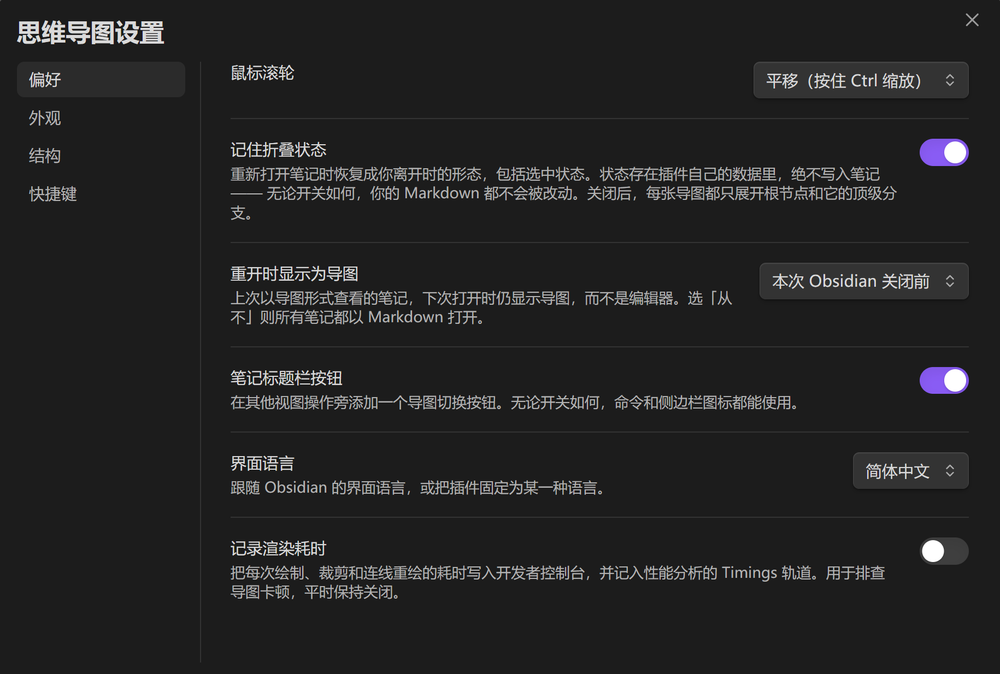

# MindFlow 使用指南

> 英文版：[Usage.md](Usage.md) ｜ 开发细节：[开发文档.md](开发文档.md)

MindFlow 把任意一篇 Obsidian 笔记切换成一张**可编辑的放射状思维导图** ——
和切到阅读模式一样简单。同一个标签页、同一个文件，**从不生成任何新文件**。

你在图上做的每一次修改，都会以最小的行级编辑写回原来那份 `.md`。切回去，
你的笔记还是你的笔记。


---

## 目录

1. [安装](#1-安装)
2. [打开与关闭导图](#2-打开与关闭导图)
3. [界面总览](#3-界面总览)
4. [在导图上编辑](#4-在导图上编辑)
5. [快捷键一览](#5-快捷键一览)
6. [快捷键设置页](#6-快捷键设置页)
7. [注解（`: text`）](#7-注解-text)
8. [正文卡片：段落、代码块、表格](#8-正文卡片段落代码块表格)
9. [在导图中查找](#9-在导图中查找)
10. [导出](#10-导出)
11. [设置项参考](#11-设置项参考)
12. [视图记忆与折叠状态](#12-视图记忆与折叠状态)
13. [在 Markdown 编辑器里插入注解行](#13-在-markdown-编辑器里插入注解行)
14. [撤销与重做](#14-撤销与重做)
15. [已知限制](#15-已知限制)
16. [常见问题](#16-常见问题)

---

## 1. 安装

插件尚未上架社区插件市场，需要手动安装。

**手动安装（推荐）：**

1. 下载 `main.js`、`manifest.json`、`styles.css` 三个文件；
2. 放进笔记库的插件目录：

   ```js
   <你的笔记库>/.obsidian/plugins/mindflow/
   ```

3. 打开 **设置 → 第三方插件**，启用 **MindFlow**。

如果发布页提供了 `mindflow.zip`，下载后直接解压到 `.obsidian/plugins/` 下，
一步到位。

**从源码构建：**

```bash
git clone https://github.com/AuroraEchop/obsidian-mindflow.git
cd obsidian-mindflow
npm install
npm run build
```

然后把 `main.js`、`manifest.json`、`styles.css` 复制进插件目录。开发时更推荐
用目录联接（junction / symlink）把仓库直接挂到插件目录，`npm run dev` 就能原地
重建，配合 *Reload app without saving* 或 Hot-Reload 插件即时生效。

---

## 2. 打开与关闭导图

对当前已经打开的笔记，下面任意一种方式都可以：

| 位置 | 操作 |
| --- | --- |
| 命令面板 | 运行 **Toggle mind map view** |
| 笔记标题栏 | 点其他视图按钮旁边的分支图标 |
| 左侧边栏 | 点侧边栏的分支图标 |
| 右键菜单 | 右键笔记 → **Open as mind map** |

也可以直接在命令面板运行 **Open current note as a mind map**。

**关闭导图**用同一个开关即可：再点一次、再运行一次命令，就会切回 Markdown。
切回去时回到你切换过来时的那个模式 —— 源码模式还是阅读模式，取决于你离开时
是哪一种。

> **建议**：给 **Toggle mind map view** 绑一个快捷键（比如 `Ctrl+Shift+M`），
> 用起来就像切换阅读模式一样自然。

---

## 3. 界面总览

### 卡片

导图上的每一张卡片对应笔记里的一行结构：

- **标题（`#`…`######`）** 按层级嵌套；
- **列表项（`-`、`*`、`+`、`1.`）** 挂在它所属的标题下面，缩进越深层级越深；
- **正文**（段落、代码块、表格）默认也会成为卡片，随所属分支一起折叠。

已经写好的内容本身就是结构 —— 不需要额外维护一份大纲。

### 角落工具栏

画布角落里有一排按钮：

| 按钮 | 作用 |
| --- | --- |
| 导出 | 展开二级菜单：Canvas / SVG / PNG / HTML |
| 放大 / 缩小 | 每次缩放一档 |
| 适应窗口 | 让整张导图完整显示在视口内 |
| 居中选中 | 把选中的卡片移到视口正中 |
| 展开/折叠全部 | 在「全部展开」和「回到打开时的折叠形状」之间切换 |
| 查找 | 打开画布上的查找栏 |
| 快捷键 | 弹出当前生效的快捷键一览 |
| 设置 | 打开 MindFlow 设置窗口 |

工具栏的行为可以在设置里调整：

- **角落工具栏**：选择「仅选中卡片时」显示，还是「始终显示」；
- **角落工具栏位置**：右下角 / 底部居中 / 右侧边缘 / 我拖动到的位置。

**直接拖动工具栏本身**就能把它挪到任意位置，松手后停靠方式自动变成
「我拖动到的位置」并记住坐标。

---

## 4. 在导图上编辑

### 鼠标操作

| 操作 | 效果 |
| --- | --- |
| 双击卡片 | 就地编辑节点标题 |
| 双击注解 | 就地编辑该节点下的注解 |
| 双击正文卡片 | 就地编辑该块内容 |
| 单击卡片 | 选中（蓝色高亮） |
| 点击正文卡片里的链接 | 打开它 —— 笔记、标题、PDF、附件或网址 |
| `Ctrl`/`Cmd` + 点击卡片 | 跳到它在笔记中的那一行 |
| 卡片旁的 **+** | 新建子节点 |
| 右键卡片 | 打开节点菜单 |
| 拖动卡片到另一张卡片上 | 改变父节点 |
| 拖动到卡片的上下边缘 | 在该卡片旁重新排序 |
| 滚轮 / 双指捏合 | 缩放；拖拽空白处平移 |

**编辑是就地进行的，不弹任何对话框。** 卡片文本直接变成可编辑字段，背景变成
不透明并浮到最上层，所以不会和别的卡片糊在一起。按 `Enter` 保存，按 `Esc`
取消，点到别处也会自动保存。


### 拖动

拖动时，指针下会跟着一张半透明副本，原位置变淡；拖到别的卡片上时，目标卡片会
高亮显示落点：

- **卡片中部** —— 成为它的子节点；
- **卡片上缘 / 下缘** —— 排到它的前面 / 后面。

副本始终跟着指针，不会跳到预测位置 —— 由你自己判断落点，看高亮就够了。


拖动跨越「标题 ↔ 列表」边界时会自动转换格式：把标题拖到列表项上，整棵子树会
变成嵌套列表；把列表项拖到标题上，它会变成顶层列表。复选框状态在来回转换中
保持不变。

**顶级分支不参与拖动排序。** 布局会按重量把它们分配到根节点的两侧，顺序由布局
决定，所以拖到顶级卡片上永远是「改父级」。

---

## 5. 快捷键一览

下面所有按键都是**默认值**，每一个都能在设置里改。

### 编辑

| 按键 | 作用 |
| --- | --- |
| `Enter` | 新建同级节点 |
| `Tab` | 新建子节点 |
| `Shift`+`Tab` | 升级（变成父节点的同级） |
| `]` | 降级（成为上方同级节点的子节点） |
| `F2` | 编辑节点标题 |
| `Ctrl`/`Cmd`+`Enter` | 添加 / 编辑注解 |
| `Shift`+`Enter` | 添加文字块 |
| `Delete` / `Backspace` | 删除节点及其全部子节点 |
| `Ctrl`/`Cmd`+`Shift`+`Enter` | 勾选 / 取消勾选 |

### 移动与折叠

| 按键 | 作用 |
| --- | --- |
| `Ctrl`/`Cmd`+`↑` / `↓` | 在同级中上移 / 下移 |
| `Space` | 折叠 / 展开 |
| `↑` `↓` `←` `→` | 移动选中状态 |

### 视图

| 按键 | 作用 |
| --- | --- |
| `Ctrl`/`Cmd`+`Z` | 撤销 |
| `Ctrl`/`Cmd`+`Shift`+`Z` 或 `Ctrl`/`Cmd`+`Y` | 重做 |
| `Ctrl`/`Cmd`+`0` | 适应窗口 |
| `Ctrl`/`Cmd`+`=` 或 `Ctrl`/`Cmd`+`+` | 放大 |
| `Ctrl`/`Cmd`+`-` | 缩小 |
| `Ctrl`/`Cmd`+`.` | 居中显示选中节点 |
| `Ctrl`/`Cmd`+`F` | 在导图中查找 |
| `Esc` | 关闭查找栏（仅在查找栏打开时由导图接管） |

> **`Ctrl`/`Cmd`+`Enter` 与 `Shift`+`Enter` 的分工**：前者是注解（挂在卡片下方
> 的一行 `: text`），后者是文字块（卡片下方独立成卡的一段缩进文字）。如果你更
> 习惯反过来，在快捷键设置里对调即可。

---

## 6. 快捷键设置页

**设置 → MindFlow → 快捷键**（或工具栏的齿轮按钮 → 快捷键页）里，列出了导图
会响应的每一个动作，一行一个，右侧显示它当前绑定的按键。


### 重新绑定

1. 点某一行的 **录制**（Record）按钮；
2. 按钮变成 **按下任意键 —— Esc 取消**；
3. 直接按下你想用的组合键。

按下什么就是什么 —— `Ctrl`、`Alt`、`Shift` 都可以带上。想中途放弃就按 `Esc`，
它会取消这次录制而不是被录进去。

> **注意**：如果你在中文输入法下发现某个组合键（尤其是 `Ctrl+Enter` 这类）按了
> 没反应，说明输入法把它吃掉了。换成 `Ctrl+Shift+字母` 这类组合通常就能避开。

### 清除与恢复

- **×** —— 清除这一行的绑定，该动作变成「未绑定」，在导图上不再响应任何按键。
- **恢复默认**（箭头图标）—— 只在被你改过的行上出现，点一下把这一行恢复成
  出厂按键。
- **全部恢复默认** —— 分组底部，一次性清掉你所有的改动。

### 冲突提示

如果两个动作被绑到了同一个按键上，两行都会显示提示：

> 同时也绑定到 {另一个动作} —— 列表中靠前的那个生效。

列表顺序就是匹配顺序，所以冲突时**上面那个动作赢**。想换过来，把下面那行的
按键改掉即可。

### 生效方式

- 已经打开的导图**立刻**跟随改动，不需要重开；
- 导图里的 **?** 快捷键面板显示的永远是**当前**生效的按键；
- 只有你改过的部分会被存进配置，所以以后版本里默认值变了，你没动过的行会跟着
  一起变。

---

## 7. 注解（`: text`）

在标题或列表项下面写一行以 `: ` 开头的文字，它就成为该节点的**注解**：以灰色
文字贴在卡片下方，带一条左侧竖线，而不是单独成卡。

```markdown
### Generalization
: Transfers a skill to an unfamiliar environment.
:
: A second paragraph.

- Adaptation
  : Improves during use.
  : A second line.
```

- 连续的 `: ` 行保留换行；
- 单独一行 `:` 表示注解里的空行；
- 过长的行按正文卡片宽度折行（**卡片最大宽度** × 1.6）；
- 注解可以把卡片撑得比标题本身更宽，但标题仍然按 **卡片最大宽度** 折行；
- 节点折叠时注解仍然可见，也不受 **显示笔记正文** 影响。


### 编辑

**双击注解**，或从节点右键菜单选 **添加注解** / **编辑注解**，注解条会就地变成
可编辑状态。`Enter` 保存，`Esc` 取消，点到别处自动保存。**清空内容后保存会
把整条注解删掉**，不会留下一个孤零零的冒号。

### 关于写法

这是本插件自己的约定，不是 Markdown 规范。在 Obsidian 的编辑视图和阅读视图里，
`: text` 仍然只是一行以冒号开头的普通段落 —— 笔记在任何别的地方读起来都还是
一篇普通笔记，插件没有往文件里塞任何只有它自己看得懂的东西。

在列表下面，注解的缩进要对齐到列表项的**内容列**（也就是该项文字开始的那一列）。
四空格以上的缩进会被当作缩进代码，围栏代码块则完全不受影响。

不想看到注解？在设置的**外观**分组里关掉 **行内注解**，这些行就会重新变回普通
的正文卡片。笔记本身一个字节都不会变。

---

## 8. 正文卡片：段落、代码块、表格

不是标题也不是列表项的内容，会留在笔记里原处不动，同时在导图上得到一张自己的
卡片，随所属分支折叠展开，并和它的兄弟节点按文件顺序交错排列。散文用阅读字体、
照常渲染行内标记；代码块用等宽字体、保留自己的换行。

**含表格的块按表格画**：表头一行、每列 `:` 声明的对齐、单元格里的 `**加粗**`、
`` `代码` ``、公式和链接都跟着来。表格的宽度由卡片宽度决定，列多或文字长时在单元格
内折行，而不是把卡片撑破。同一个块里若还有段落或代码块，也一并按各自的形状画出来。
不含表格的块仍按原来的方式画 —— 一段等宽原文。

**卡片上的内容只是预览** —— 过长的块会被截断（40 行 / 2000 字符）。**双击卡片**即可
就地编辑整块内容（也可以从右键菜单选 **编辑块源码**），那里用的是 Obsidian 自己的
阅读视图，任何 markdown 都能完整显示。

编辑文字块时，卡片上显示的是**去掉缩进**的正文（含表格的块保留空行，空行是块与块
之间的分隔），保存时插件会把缩进加回去。缩进是给解析器看的结构信息，不是给你读的。

**内容卡片不能被改名、拖动或删除** —— 那些行属于笔记，导图只是在显示它们。
（选中后用 `Delete` 删除是例外：那确实会删掉笔记里对应的行。）

在设置里关掉 **显示笔记正文**，它们就不会出现在导图上。

---

## 9. 在导图中查找

`Ctrl`/`Cmd`+`F` 会在画布上打开一个查找栏 —— Obsidian 自带的编辑器搜索够不到
导图，所以导图自带一个。

- 默认是**不区分大小写的子串**匹配；
- 勾选 `.*` 切换成正则表达式；表达式编译失败只会把输入框标红，不会抛错；
- `Enter` / `Shift`+`Enter` 在匹配项之间前后跳转，`Esc` 关闭。

匹配是按你**看得见的文字**进行的：`**bold** text` 用 "bold text" 能找到，
`[[note|Label]]` 用 "Label" 能找到、用 "note" 找不到。公式按它的 TeX 源码匹配。

跳到折叠分支里的匹配项会自动展开它，继续往下跳又会把上一个折回去，所以走完一遍
查询不会把整张图摊开。关闭查找栏时会恢复其余折叠，只留下通往你最后停下的那个
匹配项的路径，并保持选中和可见。

当前版本里高亮的是整张匹配卡片，而不是匹配的那段子串；正文卡片（段落、代码块、
表格）不参与搜索。


---

## 10. 导出

四个命令可以把导图写成一份独立的文件：**Export mind map as Canvas**、**as SVG**、
**as PNG**、**as HTML**。导图在前台时它们出现在命令面板里，也在标签页的
*更多选项* 菜单里。工具栏最左边的导出按钮会展开同样的四个选项。

**所见即所得。** 导出会带上当前的折叠形状、当前的布局（均衡 / 单侧）、分支着色
（如果开着）以及你正在用的主题配色 —— 被折叠的分支不会出现在文件里，选中圈、
查找高亮和悬停按钮也不会。

文件落在笔记旁边，用笔记名加新扩展名。**同名文件永远不会被覆盖** —— 导到已存在
的名字上会变成 `笔记 1.svg`、`笔记 2.svg`，和 Obsidian 其他地方的重名规则一致。

| 格式 | 特点 |
| --- | --- |
| **Canvas** | 可继续编辑。每张卡片变成一个文字节点，保存原始 markdown，链接、公式、格式都还能用。正文卡片带的是整块内容而不是预览。连线变成 canvas 的边。 |
| **SVG** | 矢量图，任意缩放不失真，文字仍是文字，可以选中和搜索。所有样式都内联写在文件里。 |
| **PNG** | 位图，按导图自身尺寸的 2 倍渲染；超过 16384 像素上限时会自动缩小，并在提示里说明。 |
| **HTML** | 单页静态文件，不含脚本，任何浏览器都能打开。 |

三种图片格式都把样式内联，所以文件是自包含的 —— 代价是：需要联网获取的东西不会
跟着走。正文里引用的图片不会被画出来，主题的网页字体也不会嵌入，文字会回退到
打开文件的机器上已有的字体。


---

## 11. 设置项参考

设置窗口有四个分组。窗口本身可以**拖动标题栏**挪到任意位置，尺寸固定，方便你
一边看导图一边改设置。



### 结构

| 设置项 | 说明 |
| --- | --- |
| **节点来源** | 哪些结构成为卡片：标题和列表项 / 仅标题 / 仅列表项。 |
| **最深层级标题** | 低于该层级的标题留在笔记中，作为正文内容。 |
| **根节点** | 自动（笔记只有一个顶级标题时用它，否则用文件名）/ 始终用文件名 / 始终用第一个一级标题。 |
| **新建列表项的缩进** | 自动沿用笔记中已有的缩进方式，或固定为两个空格 / 四个空格 / 制表符。 |

### 外观

| 设置项 | 说明 |
| --- | --- |
| **布局** | 均衡（顶级分支分到根节点两侧）或单侧（全部在右侧）。 |
| **分支连线** | 曲线（更像思维导图）或直角（更像层级图），见下表。 |
| **卡片样式** | 边框 / 圆角卡片 / 极简，见下表。 |
| **分支着色** | 让每个顶级分支拥有各自的颜色。 |
| **显示笔记正文** | 段落、代码块和表格成为独立卡片；含表格的块按表格画。 |
| **行内注解** | `: text` 行显示为注解，而不是独立卡片。 |
| **角落工具栏** | 仅选中卡片时显示 / 始终显示。 |
| **角落工具栏位置** | 右下角 / 底部居中 / 右侧边缘 / 我拖动到的位置。 |
| **卡片最大宽度** | 140–520，步进 20。 |
| **水平间距** | 24–160，步进 4。 |
| **垂直间距** | 4–60，步进 2。 |

**两种分支连线：**

| 样式 | 效果 |
| --- | --- |
| **曲线** | 从父卡片一侧到子卡片一侧的一条平滑 S 形曲线，读起来就是思维导图。 |
| **直角** | 在两张卡片正中间拐一次弯的折线 —— 一列子节点因此读成同一条总线，而不是一把扇子。父子落在同一行时，拐弯的两个线段重合，退化成一条直线。 |

两种样式都从卡片侧面的中点出发、到另一张卡片侧面的中点结束，线宽按层级递减
（一级 3px、二级 2px、更深 1.4px）。打开**分支着色**时，连线也跟着所在分支上色。


**三种卡片样式：**

| 样式 | 效果 |
| --- | --- |
| **边框** | 经典外观：每张卡片都有边框和背景，根节点是胶囊形，一级分支用分支色，更深的层级用细线。 |
| **圆角卡片** | 全图统一成一种卡片：每个层级都是同样的安静色块，没有边框、文字下没有分隔线，层级完全由布局和连线表达。 |
| **极简** | 静止时什么都不画，卡片就是画布上的文字；选中或编辑时才出现一个圆角边框。 |


### 偏好

| 设置项 | 说明 |
| --- | --- |
| **鼠标滚轮** | 缩放（按住 `Shift` 平移）或平移（按住 `Ctrl` 缩放）。 |
| **记住折叠状态** | 重新打开笔记时恢复成你离开时的形态，包括选中状态。状态存在插件自己的数据里，绝不写入笔记。 |
| **重开时显示为导图** | 从不 / 本次 Obsidian 关闭前 / 始终。 |
| **笔记标题栏按钮** | 在其他视图操作旁添加一个导图切换按钮。 |
| **界面语言** | 跟随 Obsidian / English / 简体中文。 |
| **记录渲染耗时** | 把每次绘制、裁剪和连线重绘的耗时写入控制台，用于排查卡顿。平时保持关闭。 |

### 快捷键

见上面的[快捷键设置页](#6-快捷键设置页)。

---

## 12. 视图记忆与折叠状态

这是两件不同的事，都在**偏好**分组里：

- **记住折叠状态** —— 回到一篇笔记时，恢复成你离开时的折叠形状，镜头落在你上次
  正在看的那张卡片上。状态按笔记路径存在插件自己的 `data.json` 里，**从不写进
  笔记**，所以不会产生 diff，也不会有合并冲突。最多保留最近 200 篇；停在默认
  折叠形状的笔记不占位置。

  关掉这个开关，每张导图都会以「根节点 + 一级分支」打开。另有一个命令
  **Forget the saved fold state for this note**，用来单独清掉某一篇的状态而不动
  设置。

- **重开时显示为导图** —— 上次以导图形式查看的笔记，下次打开时是否仍显示导图。

  - **从不**：所有笔记都以 Markdown 打开；
  - **本次 Obsidian 关闭前**：标记能活过标签页的关闭和重开，但活不过 Obsidian
    退出；
  - **始终**：写进配置，明天早上打开也还是导图。

  手动切回 Markdown 会清掉标记。

---

## 13. 在 Markdown 编辑器里插入注解行

在 Markdown 编辑器里按 `Ctrl`/`Cmd`+`Enter`，会插入一个换行加上 `: ` 前缀 ——
也就是导图读作注解的那种写法。

```markdown
- 某个列表项
  : ← 光标会停在这里，直接接着写
```

如果当前行是列表项，插入的行会自动对齐缩进并带上标记：

```markdown
- 某个列表项
- : ← 光标停在这里
```

**这个快捷键由插件自己提供**，不是修改 Obsidian 的底层快捷键配置 —— 关掉插件
它就失效，不会在你的 Obsidian 里留下任何痕迹。它同时也是一个命令
（**插入注解行（在 Markdown 编辑器中）**），可以在 **设置 → 快捷键** 里改绑到
别的按键。

---

## 14. 撤销与重做

**一篇笔记一份历史。** 无论你是在 Markdown 编辑器里改，还是在导图上改，都进同
一个撤销栈，按落笔顺序回退。

这意味着你可以：在导图上拖了一个节点 → 切到 Markdown 改几个字 → 再切回导图
按 `Ctrl+Z` —— 回退的是最近那次修改，而不是「导图这一侧」的最后一次。

撤销栈会在视图切换时保留，因为它是挂在插件上而不是挂在视图上的。

---

## 15. 已知限制

- **Setext 标题**（用 `===` 或 `---` 下划线的那种）会被当作正文内容，不成为
  节点。它们被原样保留；导图读的是 ATX（`#`）标题。
- 根节点是笔记唯一的顶级标题（如果有），否则是文件名。**文件名根节点不能在
  导图上改名**，因为那等于重命名文件。
- 折叠状态按标题路径来找回节点，所以**给节点改名会丢掉它原来的折叠位置**，
  周围的节点不受影响。
- 行内公式用的是比 Obsidian 阅读器更严格的 `$…$` 规则：内容不能以空白开头或
  结尾，结尾的 `$` 后面不能紧跟数字。这样才能让 `$5-$10` 保持是价格，代价是
  `$x$2` 会保持原样不渲染。
- 把带复选框的列表项移到标题位置时，`[x]` 会变成普通文字（标题不能有复选框）。
  移回来又会恢复成真正的复选框。
- 正文卡片（段落、代码块、表格）不参与查找。

---

## 16. 常见问题

**按了 `Ctrl+Enter` 没反应？**

先确认是在**导图**里按的。如果导图里也没反应，多半是输入法把这个组合键吃掉了 ——
换一个 `Ctrl+Shift+字母` 之类的组合即可，在快捷键设置里改。

**在 Markdown 里按 `Ctrl+Enter` 没有插入 `: `？**

确认插件处于启用状态。这个快捷键随插件加载，禁用插件后就不生效了。另外它只在
**源码模式**下工作，阅读模式没有编辑器可以插入。

**导图上的修改会改坏我的笔记吗？**

不会。每一次操作都是在原文上做**行范围拼接**，导图只是原文的一个投影：每个节点
都记着它来自哪一行、那一行由哪些片段组成（缩进、标记、空格、复选框、文字、
行尾后缀），所以能逐字符重建自己。文件从不从树重新生成。frontmatter、围栏代码、
表格、HTML 和链接永远不会被重新格式化，你没编辑过的行逐字节原样返回，包括 CRLF。

**为什么有的卡片点不动 / 不能拖？**

正文卡片代表的是笔记自己的行，它们只能读和编辑，不能改名、拖动或改父级。

**关掉插件会怎样？**

笔记不受任何影响 —— 插件从不往笔记里写只有它自己看得懂的东西。导图专用的折叠
状态存在插件数据里，禁用插件后不生效，但也不会丢失。

---

## 许可

MIT —— 见 [LICENSE](../LICENSE)。Copyright (c) 2026 AuroraEchop。

XMind、MindNode、Mubu 是各自所有者的商标，本项目与三者无隶属关系，提及它们只是为了描述画布的手感。Obsidian 是 Dynalist Inc. 的商标。
